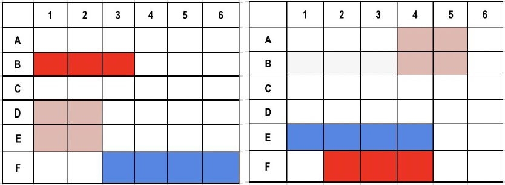

# BattleShip Game

This is web app turn-based two-player game that simulates a war between ships on an ocean. Each player gets their own battle area with a certain number of ships placed in non-overlapping positions. The ships might be of different sizes. Players cannot see each other’s ship location. A ship is considered destroyed when all of its cells are destroyed. The player who destroys all the ships of the other player first wins the game. Once the players set up the ships in their battle areas, the battle begins.

# Play

The players take turns to fire their missiles at the other player’s ships. Firing is done by targeting a particular cell given by its coordinates in the opponent’s battle area. For example, if Player-1 targets position E1 in the Player-2’s battle area and fires a missile, the player will have successfully hit a ship. On each turn, the player who received the missile should communicate to the other whether it was a hit or a miss. If a player gets a hit in a turn, they get another turn. If it’s a miss, the other player gets their turn.

# Built
App is built on Laravel 5.7

# Example 

Players could arrange their ships in their battle areas as shown in following figure.

Once the players set up the ships in their battle areas, the battle begins.
The players take turns to fire their missiles at the other player’s ships. Firing is done by targeting a particular cell given by its coordinates in the opponent’s battle area. For example, if Player-1 targets position E1 in the Player-2’s battle area and fires a missile, the player will have successfully hit a ship. On each turn, the player who received the missile should communicate to the other whether it was a hit or a miss. If a player gets a hit in a turn, they get another turn. If it’s a miss, the other player

# Architecture

